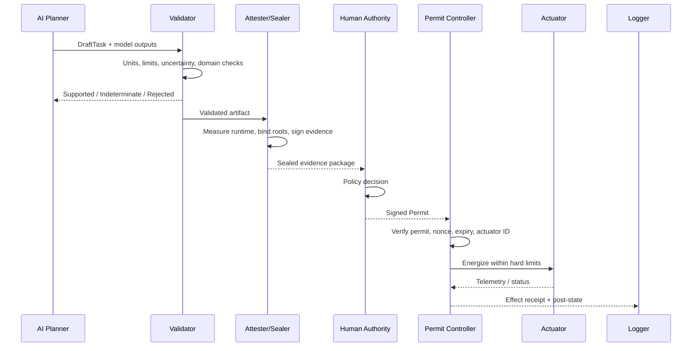

# PERMIT-GATED DEMONSTRATOR ARCHITECTURE

**Record Type:** Physical Prototyping Target
**Layer:** Builder Layer (Domain 8)
**Status:** PROPOSED

---

## Executive Summary

The most practical deliverable to test the PIC-4 governance architecture is a **permit-gated demonstrator cell**. This prototype will prove custody separation without depending on speculative quantum hardware. It ensures that an AI can propose, validators can appraise, and humans can permit, but only a separate actuator controller can energize the physical plant.

## Hardware Split

The demonstrator consists of a modest physical experiment cell (e.g., a resistive heater, calibrated current/voltage sensing, temperature probes) controlled by a secure, RATS-aligned hardware stack.

| Component | Role | Suggested Hardware |
|---|---|---|
| **Attesting Compute Node** | Runs planner, validator, sealing logic | Linux SBC + TPM 2.0, or Arm MCU with TF-M |
| **Measurement Front-End** | Acquires current, voltage, temperature | Calibrated sensors with documented uncertainty |
| **Permit Controller** | Verifies permit and enforces limits | Separate MCU or secure partition (no planner code) |
| **Actuator Stage** | Heater / Relay | Hardwired defaults to off (fail-closed) |
| **Logging Sidecar** | Stores evidence, receipts | Immutable local log / Rekor optionally |

## Software Services & Execution Flow

The software stack is organized into five isolated services mirroring the RATS (Remote ATtestation procedureS) split:

1. **Planner:** (AI) Generates proposed tasks and expected outputs.
2. **Validator:** Checks units, safety envelopes, uncertainty, and model conditions.
3. **Attester/Sealer:** Packages runtime identity, evidence roots, and the validated artifact into signed evidence.
4. **Permit Authority:** (Human/External) Issues one-shot permits bound to the artifact and actuator.
5. **Permit Controller:** Verifies permit cryptographically, enforces local hard limits, and energizes the actuator.

## Negative Test Vectors (Verification)

The test plan emphasizes authority separation and negative evidence. The demonstrator must successfully fail safely under the following conditions:

- **Replay old permit:** Rejected by nonce/expiry.
- **Wrong actuator:** Rejected by identity mismatch.
- **Wrong artifact:** Rejected by `artifactRoot` mismatch.
- **Tampered trace:** Verification failure.
- **Expired calibration:** Evidence flagged as `STALE`.
- **Planner compromised:** Actuation still impossible without external permit.
- **Validator bypassed:** Actuation still impossible without external permit.
- **Limit exceeded during actuation:** Permit controller aborts and logs failure.
- **Network loss:** Safe default remains off ($000$).
