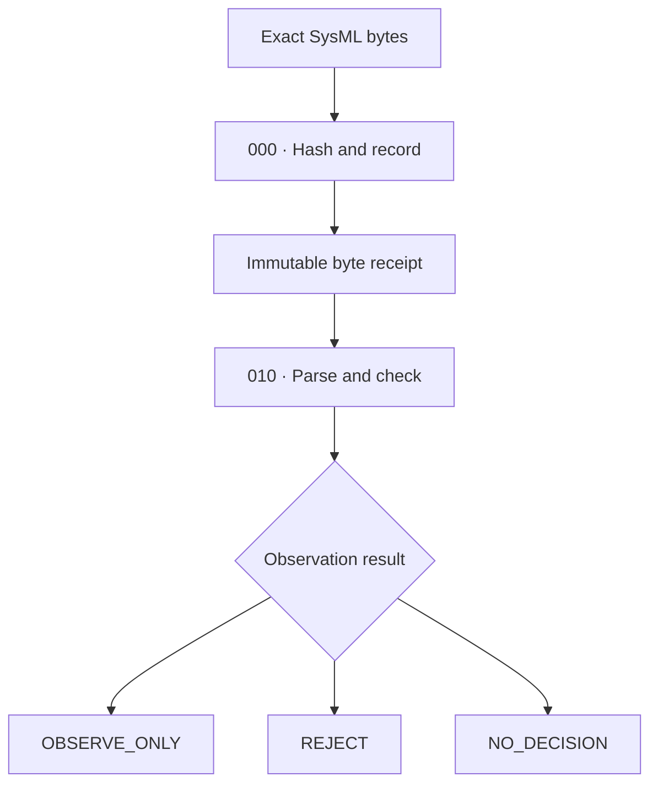

# PROPOSED: CSS-001 — SysML Byte Witness

**Record Type:** Service Surface Specification  
**Layer:** Builder / Service Surface  
**Status:** PROPOSED  
**Authority Effect:** NONE  

## 1. Surface Architecture

The key integrity rule is: **the surface must visibly distinguish “recorded,” “parsed,” and “interpreted.”** Those states must never collapse into one another.



## 2. Gradual Readiness

The current service can be truthful and usable before the parser exists:
* `000` accepts exact bytes, computes the hash, and records byte length without normalization or interpretation.
* `010` currently returns `NO_DECISION`.
* Parser readiness appears separately as `NOT_ESTABLISHED`.
* Dimensions pass through as uninterpreted syntax.
* No model execution, semantic validation, physical claims, promotion, or governance action occurs.

## 3. Metadata and Implementation Order

```yaml
surface_id: CSS-001
name: SysML Byte Witness
status: PROPOSED
authority_effect: NONE

layers:
  "000":
    operation: HASH_AND_RECORD_EXACT_BYTES
    interpretation: PROHIBITED

  "010":
    operation: PARSE_AND_CHECK
    parser_status: NOT_ESTABLISHED
    permitted_outputs:
      - OBSERVE_ONLY
      - REJECT
      - NO_DECISION

implementation_order:
  - correct_ast_byte_spans
  - preserve_raw_numeric_lexemes
  - define_token_contract
  - implement_lexer
  - establish_executable_fixtures
  - implement_parser
  - test_010_outcomes

boundaries:
  dimensions_in_lexer: PROHIBITED
  semantic_interpretation: DEFERRED
  governance_authority: NONE
```

## 4. Visual Direction
The appropriate visual direction for this surface is **Categorical Blueprint**: it expresses byte precision, structural mapping, and explicit boundaries without implying a mature or authoritative system.
