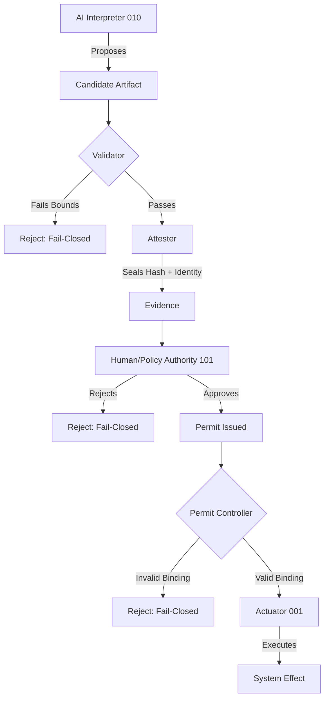
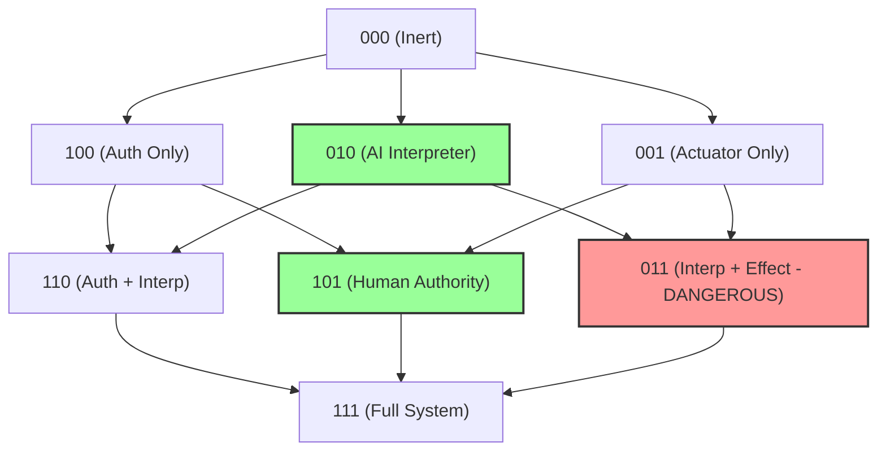
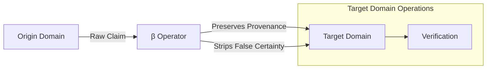

# Architecture

This document outlines the core architectural patterns demonstrated in the logos-formal repository.

## PIC-4 Governance Flow

The core invariant of this architecture is that the AI's interpretation never writes to the capability/authorization geometry. The flow below demonstrates how an AI system is constrained.

**Explanation:** The AI generates a plan (Candidate Artifact). A Validator performs static checks. An Attester seals this into Evidence. Only an external Authority (human or strict policy) can issue a Permit. The Actuator verifies the Permit before execution, ensuring the AI cannot authorize its own plans.

## The Cubed Bit Lattice (A, I, E)

The system is modeled using a "Cubed Bit" state lattice representing Authorization (A), Interpretation (I), and Effect (E).

**Explanation:** AI operates strictly at `010` (pure interpretation). It has no authority (A) and no direct effect (E). Only Human Authority operates at `101` (Authorized Effect), holding the power to bridge intent to reality. The system actively prevents the `011` state, where interpretation couples directly to effect without authorization.

## Bleed-Over Operator (β) Flow

The Bleed-Over Operator (β) governs how claims translate across different fields of operation, preserving provenance without inflating certainty.

**Explanation:** When information moves between domains (e.g., from a probabilistic AI model to a deterministic authorization engine), the β operator translates the claim. It ensures the origin's provenance is kept intact but strips away unearned certainty, preventing the target domain from treating an AI guess as a hard operational fact.
